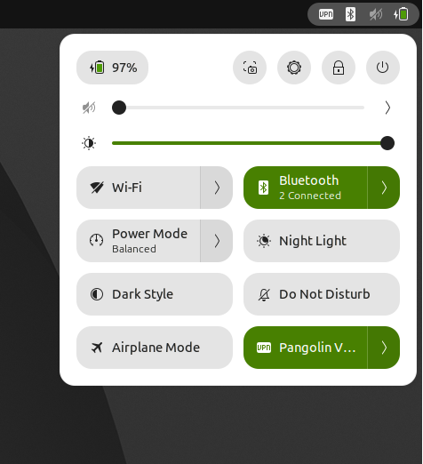

# Pangolin GNOME Status Indicator

A GNOME Shell extension that adds a status indicator and quick toggle for the [Pangolin](https://github.com/fosrl/pangolin) VPN client.

Shows connection status in the system panel and provides connect/disconnect controls from the quick settings menu.



## Install

```bash
./install.sh
```

Then restart GNOME Shell (Alt+F2 → `r`) or log out and back in.

## Uninstall

```bash
./uninstall.sh
```

Then restart GNOME Shell or log out and back in.

## Requirements

- GNOME Shell 45+
- [Pangolin](https://github.com/fosrl/pangolin) VPN client installed and in your `PATH`
- `sudo` and `zenity` (for the graphical password prompt when connecting)
